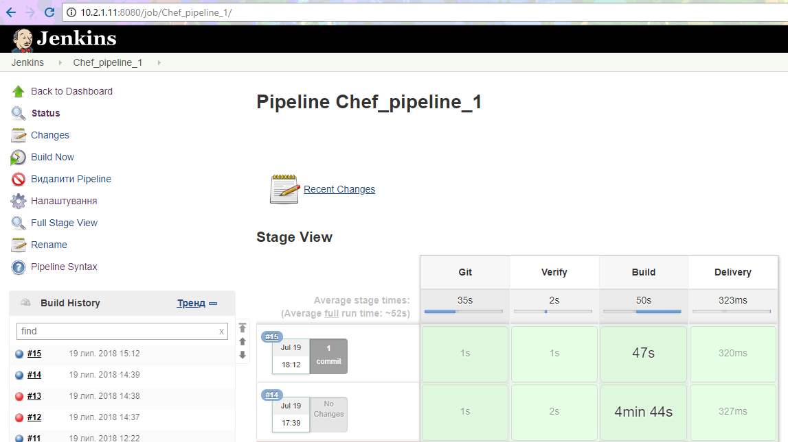

# Task
1) Create simple inspec test for your cookbook (please use cookbook from 2nd task). Check folders permissions, users…
2) Create kitchen.yml to test your cookbook (you can use any driver)
3) Create cookbook pipeline:
> •	Verify. Run lint tools, syntax checks and unit tests
> •	Build. Run Test Kitchen against your cookbook and include inspec tests
> •	Delivered. Upload your cookbook to Chef Server.

Please use any CI/CD which you prefer most of all for this task.

Apache installing was chosen as a work cookbook for this task.

## Solution

In `default.rb` recipe `my-apache` cookbook we create a user, install *apache2* package and change content of default `index.html` file with the help of template `apache.erb`.

 ```ruby
 apt_update 'repo' do
   action :update
 end
 user 'user1' do
   manage_home true
   system true
   action :create
 end
 apt_package 'apache2' do
   action :install
 end
 template '/var/www/html/index.html' do
   source 'apache.erb'
   owner 'root'
   group 'root'
   mode '0644'
   variables(text: 'Welcome to Apache2 deployed by Chef!')
   action :create
 end
```
For relevant inspec tests the `spec_helper.rb` war rewritten.

 ```ruby
 require 'chefspec'
 require 'chefspec/berkshelf'

 RSpec.configure do |sp|
   sp.log_level = :info
   sp.file_cache_path = Chef::Config[:file_cache_path]
   sp.color = true
 end

 Dir['*_spec.rb'].each { |f| require File.expand_path(f) }
 at_exit { ChefSpec::Coverage.report! }
```

Appropriate script with inspec test looks like (`my-apache_spec.rb`):

 ```ruby
 require 'spec_helper'
 require 'chef-vault'

 describe 'my-apache::default' do
   let(:chef_run) { ChefSpec::SoloRunner.new(platform: 'ubuntu', version: '16.04').converge(described_recipe) }

   it 'apache::template' do
     expect(chef_run).to create_template('/var/www/html/index.html')
   end

   it 'create::users' do
     expect(chef_run).to create_user('user1')
   end

   it 'update:apt_repo' do
     expect(chef_run).to update_apt_update('repo')
   end

   it 'install::apache2' do
     expect(chef_run).to install_apt_package('apache2')
   end
 end
```

Script with integration tests - `default_tests.rb` has default check points:

 ```ruby
 describe user('user1') do
   it { should exist }
 end

 describe port(80) do
   it { should_not be_listening }
 end

 describe package('apache2') do
   it { should be_installed }
 end
```

For executing 3rd task the Vagrantfile from previous tasks war modified and as a result 3 virtual machines are starting up:
> 1. Chef-server: chef-server package, chefDK package,
> 2. Chef-client node: chef-client package,
> 3. Jenkins: here the CI/CD process could be run.

`Chef-server` is a node of Jenkins where all stages of pipeline are running.
To perform that appropriate actions were done, e.g.,:
 > - Java installation
 > - Jenkins installation and configuring, etc.

All that were done with the help of provision files that are used in *Vagrantfile*.

To provide relevant CI/CD I chose GitHub public repository from where source files are cloning to the workspace of Jenkins node and executing least of stages.

 ```
 node ('chef-server') {
     stage('Git'){
         git url: 'https://github.com/AnnMuravskaya/chef-task-3.git'    
     }
     stage('Verify'){
         sh """cookstyle cookbooks/my-apache
               foodcritic cookbooks/my-apache/recipes/default.rb"""
     }
     stage('Build'){
         sh """cd cookbooks && chef exec rspec
         chef gem install kitchen-docker
         ls
         cd my-apache/ && kitchen test"""
     }
     stage('Delivery'){
         sh """echo [INFO]: Upload cookbook 'my-apache' to chef-server
               #knife node run_list add chefclient 'my-apache'"""
     }
 }
```

The following picture describes pipeline job results.

